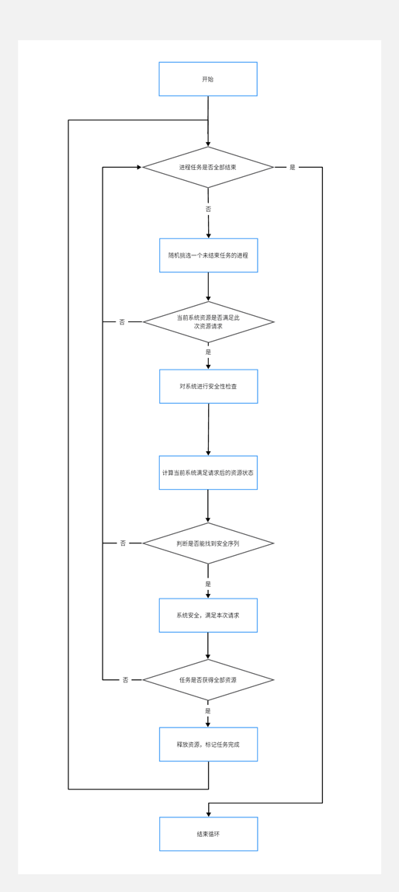

# **银行家算法**

**一、实验目的**

死锁会引起计算机工作僵死，因此操作系统中必须防止。本实验的目的在于让 学生独立的使用高级语言编写和调试一个系统动态分配资源的简单模拟程序，了解 死锁产生的条件和原因，并采用银行家算法有效地防止死锁的发生，以加深对课堂 上所讲授的知识的理解。

**二、实验要求**

设计有 n 个进程共享 m 个系统资源的系统，进程可动态的申请和释放资源，系统按各进程的申请动态的分配资源。 系统能显示各个进程申请和释放资源，以及系统动态分配资源的过程，便于用 户观察和分析；

 

**三、数据结构**

\1. 可利用资源向量 Available ，它是一个含有 m 个元素的数组，其中的每一个元素 代表一类可利用的资源的数目，其初始值是系统中所配置的该类全部可用资源数 目。其数值随该类资源的分配和回收而动态地改变。如果 Available（j）=k，标是 系统中现有 Rj 类资源 k 个。 

2．最大需求矩阵 Max，这是一个 n×m 的矩阵，它定义了系统中 n 个进程中的每一 个进程对 m 类资源的最大需求。如果 Max（i，j）=k，表示进程 i 需要 Rj 类资源 的最大数目为 k。 

3．分配矩阵 Allocation，这是一个 n×m 的矩阵，它定义了系统中的每类资源当前 一分配到每一个进程的资源数。如果 Allocation（i，j）=k，表示进程 i 当前已经 分到 Rj 类资源的数目为 k。Allocation i表示进程 i 的分配向量，有矩阵 Allocation 7 的第 i 行构成。

4．需求矩阵 Need，这是一个 n×m 的矩阵，用以表示每个进程还需要的各类资源的 数目。如果 Need（i，j）=k，表示进程 i 还需要 Rj 类资源 k 个，才能完成其任 务。Need i表示进程 i 的需求向量，由矩阵 Need 的第 i 行构成。 上述三个矩阵间存在关系：Need（i，j）=Max（i，j）-Allocation（i，j）；

5.任务完成标记位finishStatus，它是一个含有n个布尔元素的一维数组，用来标记第i个进程是否执行完毕。false为未执行完毕，true为执行完毕。

**四、银行家算法**

 

设Request.是进程P的请求向量，如果Request:[j]=K. 则表示进程P需要K个R类型的资源。当使用random使得P发出资源请求后，系统会按下列步骤进行检查。
 
 (1)如果Request[j] ≤ Need[i][j]. 则转向步骤(2) ;否则认为出错，因为它所需要的资源数已超过它所宣布的最大值。
 
 (2)如果Rquest[j] ≤ Available[j] 则转向步骤(3);否则表示尚无足够资源，P须等待。

 

(3)系统试探着把资源分配给进程P，并修改下列数据结构中的数值:
 
 Available[j] = Available[j]- Request[j] ;
 
 Allocation[j] = Allocation[i][j]+ Request[j] ;
 
 Need[i][j] = Need[i][j]- Request[j]。
 
 (4)系统执行安全性算法，检查此次资源分配后系统是否处于安全状态。若是，则正式将资源分配给进程P.以完成本次分配:否则， 将本次的试探分配作废，恢复原来的资源分配，让进程P等待。

 

(5)不断循环以上步骤，直到finfishStatus标记的所有进程任务全部结束后停止循环。

 

 

 

 

 

**五、安全性算法** 

1．设置两个向量。 AvailableCopy：它表示系统可提供给进程继续运行的各类资源数目，它包含 m 个元素， 开始执行安全性算法时，AvailableCopy = Available - request。 Finish：它表示系统是否有足够的资源分配给进程，使之运行完成，开始finishStatus[i] =false；当有足够资源分配给进程 Pi 时，令 finishStatus[i]=true； 

 

2．从进程集合中找到下一个能满足下述条件的进程。 finishStatus[i] == false； Need [i] ≤ AvailableCopy； 如找到则执行步骤 3；否则，执行步骤 4； 

 

3．当进程 Pi 获得资源后，可顺利执行直到完成，并释放出分配给它的资源，故应 执行 AvailableCopy = AvailableCopy + Allocation[i] 

finishStatus[i]=true；转向步骤 2； 

 

4．若所有进程的 finishStatus[i]=true都为 true，则表示系统处于安全状态；否则，系统处于不安全状态。


 

**六、参考流程（仅作一种参考）**

 

****


**七、实验报告**

 

**测试数据**

**1****组**

```java
请输入资源数量： 

5 

请输入系统资源总数(用','隔开)： 

5,3,4,6,2 

请输入进程数量： 

6 

请输入进程1需要的资源总数MAX(用','隔开)： 

1,2,3,3,1 

请输入进程2需要的资源总数MAX(用','隔开)： 

3,2,1,4,1 

请输入进程3需要的资源总数MAX(用','隔开)： 

4,1,2,1,1 

请输入进程4需要的资源总数MAX(用','隔开)： 

2,2,2,4,2 

请输入进程5需要的资源总数MAX(用','隔开)： 

1,2,1,1,1 

请输入进程6需要的资源总数MAX(用','隔开)： 

3,2,1,3,1 
```

 

**2****组**

```java
请输入资源数量： 

3 

请输入系统资源总数(用','隔开)： 

4,5,6 

请输入进程数量： 

4 

请输入进程1需要的资源总数MAX(用','隔开)： 

4,1,1 

请输入进程2需要的资源总数MAX(用','隔开)： 

1,4,1 

请输入进程3需要的资源总数MAX(用','隔开)： 

1,1,6 

请输入进程4需要的资源总数MAX(用','隔开)： 

1,1,1 
```

 

 

**3****组**

```java
请输入资源数量： 

2 

请输入系统资源总数(用','隔开)： 

1,2 

请输入进程数量： 

8 

请输入进程1需要的资源总数MAX(用','隔开)： 

1,1 

请输入进程2需要的资源总数MAX(用','隔开)： 

0,1 

请输入进程3需要的资源总数MAX(用','隔开)： 

1,0 

请输入进程4需要的资源总数MAX(用','隔开)： 

0,2 

请输入进程5需要的资源总数MAX(用','隔开)： 

1,1 

请输入进程6需要的资源总数MAX(用','隔开)： 

0,1 

请输入进程7需要的资源总数MAX(用','隔开)： 

1,2 

请输入进程8需要的资源总数MAX(用','隔开)： 

1,1 
```

 

 

**运行结果**

**1****组**

```java
================================== 

当前系统进程资源分配情况 

进程名称    Max        Allocation        Need 

进程1：     1,2,3,3,1     0,0,0,0,0        1,2,3,3,1 

进程2：     3,2,1,4,1     0,0,0,0,0        3,2,1,4,1 

进程3：     4,1,2,1,1     0,0,0,0,0        4,1,2,1,1 

进程4：     2,2,2,4,2     0,0,0,0,0        2,2,2,4,2 

进程5：     1,2,1,1,1     0,0,0,0,0        1,2,1,1,1 

进程6：     3,2,1,3,1     0,0,0,0,0        3,2,1,3,1 

进程2向操作系统申请资源：3;2;1;1;1; 

系统目前资源数量：5;3;4;6;2; 可满足 

---------------系统将检查本次分配后的安全状态--------------- 

检查安全序列为：进程2;进程3;进程4;进程5;进程6;进程1;系统安全，确认资源分配 

\--------------------------------------------------------- 

==================================== 

 

==================================== 

当前系统进程资源分配情况 

进程名称    Max        Allocation        Need 

进程1：     1,2,3,3,1     0,0,0,0,0        1,2,3,3,1 

进程2：     3,2,1,4,1     3,2,1,1,1        0,0,0,3,0 

进程3：     4,1,2,1,1     0,0,0,0,0        4,1,2,1,1 

进程4：     2,2,2,4,2     0,0,0,0,0        2,2,2,4,2 

进程5：     1,2,1,1,1     0,0,0,0,0        1,2,1,1,1 

进程6：     3,2,1,3,1     0,0,0,0,0        3,2,1,3,1 

进程1向操作系统申请资源：1;2;2;3;1; 

系统目前资源数量：2;1;3;5;1; 拒绝受理 

==================================== 

当前系统进程资源分配情况 

进程名称    Max        Allocation        Need 

进程1：     1,2,3,3,1     0,0,0,0,0        1,2,3,3,1 

进程2：     3,2,1,4,1     3,2,1,1,1        0,0,0,3,0 

进程3：     4,1,2,1,1     0,0,0,0,0        4,1,2,1,1 

进程4：     2,2,2,4,2     0,0,0,0,0        2,2,2,4,2 

进程5：     1,2,1,1,1     0,0,0,0,0        1,2,1,1,1 

进程6：     3,2,1,3,1     0,0,0,0,0        3,2,1,3,1 

进程3向操作系统申请资源：2;1;1;1;1; 

系统目前资源数量：2;1;3;5;1; 可满足 

---------------系统将检查本次分配后的安全状态--------------- 

检查安全序列为：进程2;进程3;进程4;进程5;进程6;进程1;系统安全，确认资源分配 

\--------------------------------------------------------- 

==================================== 

 

==================================== 

当前系统进程资源分配情况 

进程名称    Max        Allocation        Need 

进程1：     1,2,3,3,1     0,0,0,0,0        1,2,3,3,1 

进程2：     3,2,1,4,1     3,2,1,1,1        0,0,0,3,0 

进程3：     4,1,2,1,1     2,1,1,1,1        2,0,1,0,0 

进程4：     2,2,2,4,2     0,0,0,0,0        2,2,2,4,2 

进程5：     1,2,1,1,1     0,0,0,0,0        1,2,1,1,1 

进程6：     3,2,1,3,1     0,0,0,0,0        3,2,1,3,1 

进程1向操作系统申请资源：1;1;1;3;1; 

系统目前资源数量：0;0;2;4;0; 拒绝受理 

==================================== 

当前系统进程资源分配情况 

进程名称    Max        Allocation        Need 

进程1：     1,2,3,3,1     0,0,0,0,0        1,2,3,3,1 

进程2：     3,2,1,4,1     3,2,1,1,1        0,0,0,3,0 

进程3：     4,1,2,1,1     2,1,1,1,1        2,0,1,0,0 

进程4：     2,2,2,4,2     0,0,0,0,0        2,2,2,4,2 

进程5：     1,2,1,1,1     0,0,0,0,0        1,2,1,1,1 

进程6：     3,2,1,3,1     0,0,0,0,0        3,2,1,3,1 

进程2向操作系统申请资源：0;0;0;3;0; 

系统目前资源数量：0;0;2;4;0; 可满足 

---------------系统将检查本次分配后的安全状态--------------- 

检查安全序列为：进程2;进程3;进程4;进程5;进程6;进程1;系统安全，确认资源分配 

\--------------------------------------------------------- 

==================================== 

 

==================================== 

当前系统进程资源分配情况 

进程名称    Max        Allocation        Need 

进程1：     1,2,3,3,1     0,0,0,0,0        1,2,3,3,1 

进程2：     3,2,1,4,1     3,2,1,4,1        0,0,0,0,0 

进程3：     4,1,2,1,1     2,1,1,1,1        2,0,1,0,0 

进程4：     2,2,2,4,2     0,0,0,0,0        2,2,2,4,2 

进程5：     1,2,1,1,1     0,0,0,0,0        1,2,1,1,1 

进程6：     3,2,1,3,1     0,0,0,0,0        3,2,1,3,1 

进程6向操作系统申请资源：2;1;1;1;1; 

系统目前资源数量：3;2;3;5;1; 可满足 

---------------系统将检查本次分配后的安全状态--------------- 

检查安全序列为：进程6;进程1;进程3;进程4;进程5;系统安全，确认资源分配 

\--------------------------------------------------------- 

==================================== 

 

==================================== 

当前系统进程资源分配情况 

进程名称    Max        Allocation        Need 

进程1：     1,2,3,3,1     0,0,0,0,0        1,2,3,3,1 

进程2：     3,2,1,4,1     3,2,1,4,1        0,0,0,0,0 

进程3：     4,1,2,1,1     2,1,1,1,1        2,0,1,0,0 

进程4：     2,2,2,4,2     0,0,0,0,0        2,2,2,4,2 

进程5：     1,2,1,1,1     0,0,0,0,0        1,2,1,1,1 

进程6：     3,2,1,3,1     2,1,1,1,1        1,1,0,2,0 

进程6向操作系统申请资源：1;1;0;2;0; 

系统目前资源数量：1;1;2;4;0; 可满足 

---------------系统将检查本次分配后的安全状态--------------- 

检查安全序列为：进程6;进程1;进程3;进程4;进程5;系统安全，确认资源分配 

\--------------------------------------------------------- 

==================================== 

 

==================================== 

当前系统进程资源分配情况 

进程名称    Max        Allocation        Need 

进程1：     1,2,3,3,1     0,0,0,0,0        1,2,3,3,1 

进程2：     3,2,1,4,1     3,2,1,4,1        0,0,0,0,0 

进程3：     4,1,2,1,1     2,1,1,1,1        2,0,1,0,0 

进程4：     2,2,2,4,2     0,0,0,0,0        2,2,2,4,2 

进程5：     1,2,1,1,1     0,0,0,0,0        1,2,1,1,1 

进程6：     3,2,1,3,1     3,2,1,3,1        0,0,0,0,0 

进程5向操作系统申请资源：1;1;1;1;1; 

系统目前资源数量：3;2;3;5;1; 可满足 

---------------系统将检查本次分配后的安全状态--------------- 

检查安全序列为：进程3;进程5;进程1;进程4;系统安全，确认资源分配 

\--------------------------------------------------------- 

==================================== 

 

==================================== 

当前系统进程资源分配情况 

进程名称    Max        Allocation        Need 

进程1：     1,2,3,3,1     0,0,0,0,0        1,2,3,3,1 

进程2：     3,2,1,4,1     3,2,1,4,1        0,0,0,0,0 

进程3：     4,1,2,1,1     2,1,1,1,1        2,0,1,0,0 

进程4：     2,2,2,4,2     0,0,0,0,0        2,2,2,4,2 

进程5：     1,2,1,1,1     1,1,1,1,1        0,1,0,0,0 

进程6：     3,2,1,3,1     3,2,1,3,1        0,0,0,0,0 

进程5向操作系统申请资源：0;1;0;0;0; 

系统目前资源数量：2;1;2;4;0; 可满足 

---------------系统将检查本次分配后的安全状态--------------- 

检查安全序列为：进程3;进程5;进程1;进程4;系统安全，确认资源分配 

\--------------------------------------------------------- 

==================================== 

 

==================================== 

当前系统进程资源分配情况 

进程名称    Max        Allocation        Need 

进程1：     1,2,3,3,1     0,0,0,0,0        1,2,3,3,1 

进程2：     3,2,1,4,1     3,2,1,4,1        0,0,0,0,0 

进程3：     4,1,2,1,1     2,1,1,1,1        2,0,1,0,0 

进程4：     2,2,2,4,2     0,0,0,0,0        2,2,2,4,2 

进程5：     1,2,1,1,1     1,2,1,1,1        0,0,0,0,0 

进程6：     3,2,1,3,1     3,2,1,3,1        0,0,0,0,0 

进程3向操作系统申请资源：1;0;1;0;0; 

系统目前资源数量：3;2;3;5;1; 可满足 

---------------系统将检查本次分配后的安全状态--------------- 

检查安全序列为：进程3;进程4;进程1;系统安全，确认资源分配 

\--------------------------------------------------------- 

==================================== 

 

==================================== 

当前系统进程资源分配情况 

进程名称    Max        Allocation        Need 

进程1：     1,2,3,3,1     0,0,0,0,0        1,2,3,3,1 

进程2：     3,2,1,4,1     3,2,1,4,1        0,0,0,0,0 

进程3：     4,1,2,1,1     3,1,2,1,1        1,0,0,0,0 

进程4：     2,2,2,4,2     0,0,0,0,0        2,2,2,4,2 

进程5：     1,2,1,1,1     1,2,1,1,1        0,0,0,0,0 

进程6：     3,2,1,3,1     3,2,1,3,1        0,0,0,0,0 

进程1向操作系统申请资源：1;1;2;2;1; 

系统目前资源数量：2;2;2;5;1; 可满足 

---------------系统将检查本次分配后的安全状态--------------- 

检查安全序列为：进程3;进程1;进程4;系统安全，确认资源分配 

\--------------------------------------------------------- 

==================================== 

 

==================================== 

当前系统进程资源分配情况 

进程名称    Max        Allocation        Need 

进程1：     1,2,3,3,1     1,1,2,2,1        0,1,1,1,0 

进程2：     3,2,1,4,1     3,2,1,4,1        0,0,0,0,0 

进程3：     4,1,2,1,1     3,1,2,1,1        1,0,0,0,0 

进程4：     2,2,2,4,2     0,0,0,0,0        2,2,2,4,2 

进程5：     1,2,1,1,1     1,2,1,1,1        0,0,0,0,0 

进程6：     3,2,1,3,1     3,2,1,3,1        0,0,0,0,0 

进程4向操作系统申请资源：1;1;1;4;1; 

系统目前资源数量：1;1;0;3;0; 拒绝受理 

==================================== 

当前系统进程资源分配情况 

进程名称    Max        Allocation        Need 

进程1：     1,2,3,3,1     1,1,2,2,1        0,1,1,1,0 

进程2：     3,2,1,4,1     3,2,1,4,1        0,0,0,0,0 

进程3：     4,1,2,1,1     3,1,2,1,1        1,0,0,0,0 

进程4：     2,2,2,4,2     0,0,0,0,0        2,2,2,4,2 

进程5：     1,2,1,1,1     1,2,1,1,1        0,0,0,0,0 

进程6：     3,2,1,3,1     3,2,1,3,1        0,0,0,0,0 

进程1向操作系统申请资源：0;1;1;1;0; 

系统目前资源数量：1;1;0;3;0; 拒绝受理 

==================================== 

当前系统进程资源分配情况 

进程名称    Max        Allocation        Need 

进程1：     1,2,3,3,1     1,1,2,2,1        0,1,1,1,0 

进程2：     3,2,1,4,1     3,2,1,4,1        0,0,0,0,0 

进程3：     4,1,2,1,1     3,1,2,1,1        1,0,0,0,0 

进程4：     2,2,2,4,2     0,0,0,0,0        2,2,2,4,2 

进程5：     1,2,1,1,1     1,2,1,1,1        0,0,0,0,0 

进程6：     3,2,1,3,1     3,2,1,3,1        0,0,0,0,0 

进程1向操作系统申请资源：0;1;1;1;0; 

系统目前资源数量：1;1;0;3;0; 拒绝受理 

==================================== 

当前系统进程资源分配情况 

进程名称    Max        Allocation        Need 

进程1：     1,2,3,3,1     1,1,2,2,1        0,1,1,1,0 

进程2：     3,2,1,4,1     3,2,1,4,1        0,0,0,0,0 

进程3：     4,1,2,1,1     3,1,2,1,1        1,0,0,0,0 

进程4：     2,2,2,4,2     0,0,0,0,0        2,2,2,4,2 

进程5：     1,2,1,1,1     1,2,1,1,1        0,0,0,0,0 

进程6：     3,2,1,3,1     3,2,1,3,1        0,0,0,0,0 

进程3向操作系统申请资源：1;0;0;0;0; 

系统目前资源数量：1;1;0;3;0; 可满足 

---------------系统将检查本次分配后的安全状态--------------- 

检查安全序列为：进程3;进程1;进程4;系统安全，确认资源分配 

\--------------------------------------------------------- 

==================================== 

 

==================================== 

当前系统进程资源分配情况 

进程名称    Max        Allocation        Need 

进程1：     1,2,3,3,1     1,1,2,2,1        0,1,1,1,0 

进程2：     3,2,1,4,1     3,2,1,4,1        0,0,0,0,0 

进程3：     4,1,2,1,1     4,1,2,1,1        0,0,0,0,0 

进程4：     2,2,2,4,2     0,0,0,0,0        2,2,2,4,2 

进程5：     1,2,1,1,1     1,2,1,1,1        0,0,0,0,0 

进程6：     3,2,1,3,1     3,2,1,3,1        0,0,0,0,0 

进程4向操作系统申请资源：2;1;1;1;2; 

系统目前资源数量：4;2;2;4;1; 拒绝受理 

==================================== 

当前系统进程资源分配情况 

进程名称    Max        Allocation        Need 

进程1：     1,2,3,3,1     1,1,2,2,1        0,1,1,1,0 

进程2：     3,2,1,4,1     3,2,1,4,1        0,0,0,0,0 

进程3：     4,1,2,1,1     4,1,2,1,1        0,0,0,0,0 

进程4：     2,2,2,4,2     0,0,0,0,0        2,2,2,4,2 

进程5：     1,2,1,1,1     1,2,1,1,1        0,0,0,0,0 

进程6：     3,2,1,3,1     3,2,1,3,1        0,0,0,0,0 

进程1向操作系统申请资源：0;1;1;1;0; 

系统目前资源数量：4;2;2;4;1; 可满足 

---------------系统将检查本次分配后的安全状态--------------- 

检查安全序列为：进程1;进程4;系统安全，确认资源分配 

\--------------------------------------------------------- 

==================================== 

 

==================================== 

当前系统进程资源分配情况 

进程名称    Max        Allocation        Need 

进程1：     1,2,3,3,1     1,2,3,3,1        0,0,0,0,0 

进程2：     3,2,1,4,1     3,2,1,4,1        0,0,0,0,0 

进程3：     4,1,2,1,1     4,1,2,1,1        0,0,0,0,0 

进程4：     2,2,2,4,2     0,0,0,0,0        2,2,2,4,2 

进程5：     1,2,1,1,1     1,2,1,1,1        0,0,0,0,0 

进程6：     3,2,1,3,1     3,2,1,3,1        0,0,0,0,0 

进程4向操作系统申请资源：1;2;1;4;1; 

系统目前资源数量：5;3;4;6;2; 可满足 

---------------系统将检查本次分配后的安全状态--------------- 

检查安全序列为：进程4;系统安全，确认资源分配 

\--------------------------------------------------------- 

==================================== 

 

==================================== 

当前系统进程资源分配情况 

进程名称    Max        Allocation        Need 

进程1：     1,2,3,3,1     1,2,3,3,1        0,0,0,0,0 

进程2：     3,2,1,4,1     3,2,1,4,1        0,0,0,0,0 

进程3：     4,1,2,1,1     4,1,2,1,1        0,0,0,0,0 

进程4：     2,2,2,4,2     1,2,1,4,1        1,0,1,0,1 

进程5：     1,2,1,1,1     1,2,1,1,1        0,0,0,0,0 

进程6：     3,2,1,3,1     3,2,1,3,1        0,0,0,0,0 

进程4向操作系统申请资源：1;0;1;0;1; 

系统目前资源数量：4;1;3;2;1; 可满足 

---------------系统将检查本次分配后的安全状态--------------- 

检查安全序列为：进程4;系统安全，确认资源分配 

\--------------------------------------------------------- 

==================================== 

 

模拟结束 

系统目前资源数量：5;3;4;6;2; 
```

 

**2****组**

```java
================================== 

当前系统进程资源分配情况 

进程名称    Max        Allocation        Need 

进程1：     4,1,1       0,0,0          4,1,1 

进程2：     1,4,1       0,0,0          1,4,1 

进程3：     1,1,6       0,0,0          1,1,6 

进程4：     1,1,1       0,0,0          1,1,1 

进程3向操作系统申请资源：1;1;5; 

系统目前资源数量：4;5;6; 可满足 

---------------系统将检查本次分配后的安全状态--------------- 

检查安全序列为：进程2;进程3;进程4;进程1;系统安全，确认资源分配 

\--------------------------------------------------------- 

==================================== 

 

==================================== 

当前系统进程资源分配情况 

进程名称    Max        Allocation        Need 

进程1：     4,1,1       0,0,0          4,1,1 

进程2：     1,4,1       0,0,0          1,4,1 

进程3：     1,1,6       1,1,5          0,0,1 

进程4：     1,1,1       0,0,0          1,1,1 

进程4向操作系统申请资源：1;1;1; 

系统目前资源数量：3;4;1; 可满足 

---------------系统将检查本次分配后的安全状态--------------- 

检查安全序列为：进程4;进程2;进程3;进程1;系统安全，确认资源分配 

\--------------------------------------------------------- 

==================================== 

 

==================================== 

当前系统进程资源分配情况 

进程名称    Max        Allocation        Need 

进程1：     4,1,1       0,0,0          4,1,1 

进程2：     1,4,1       0,0,0          1,4,1 

进程3：     1,1,6       1,1,5          0,0,1 

进程4：     1,1,1       1,1,1          0,0,0 

进程1向操作系统申请资源：1;1;1; 

系统目前资源数量：3;4;1; 可满足 

---------------系统将检查本次分配后的安全状态--------------- 

检查安全序列为：无法找到安全序列,系统不安全 

==================================== 

当前系统进程资源分配情况 

进程名称    Max        Allocation        Need 

进程1：     4,1,1       0,0,0          4,1,1 

进程2：     1,4,1       0,0,0          1,4,1 

进程3：     1,1,6       1,1,5          0,0,1 

进程4：     1,1,1       1,1,1          0,0,0 

进程3向操作系统申请资源：0;0;1; 

系统目前资源数量：3;4;1; 可满足 

---------------系统将检查本次分配后的安全状态--------------- 

检查安全序列为：进程3;进程1;进程2;系统安全，确认资源分配 

\--------------------------------------------------------- 

==================================== 

 

==================================== 

当前系统进程资源分配情况 

进程名称    Max        Allocation        Need 

进程1：     4,1,1       0,0,0          4,1,1 

进程2：     1,4,1       0,0,0          1,4,1 

进程3：     1,1,6       1,1,6          0,0,0 

进程4：     1,1,1       1,1,1          0,0,0 

进程2向操作系统申请资源：1;4;1; 

系统目前资源数量：4;5;6; 可满足 

---------------系统将检查本次分配后的安全状态--------------- 

检查安全序列为：进程2;进程1;系统安全，确认资源分配 

\--------------------------------------------------------- 

==================================== 

 

==================================== 

当前系统进程资源分配情况 

进程名称    Max        Allocation        Need 

进程1：     4,1,1       0,0,0          4,1,1 

进程2：     1,4,1       1,4,1          0,0,0 

进程3：     1,1,6       1,1,6          0,0,0 

进程4：     1,1,1       1,1,1          0,0,0 

进程1向操作系统申请资源：2;1;1; 

系统目前资源数量：4;5;6; 可满足 

---------------系统将检查本次分配后的安全状态--------------- 

检查安全序列为：进程1;系统安全，确认资源分配 

\--------------------------------------------------------- 

==================================== 

 

==================================== 

当前系统进程资源分配情况 

进程名称    Max        Allocation        Need 

进程1：     4,1,1       2,1,1          2,0,0 

进程2：     1,4,1       1,4,1          0,0,0 

进程3：     1,1,6       1,1,6          0,0,0 

进程4：     1,1,1       1,1,1          0,0,0 

进程1向操作系统申请资源：1;0;0; 

系统目前资源数量：2;4;5; 可满足 

---------------系统将检查本次分配后的安全状态--------------- 

检查安全序列为：进程1;系统安全，确认资源分配 

\--------------------------------------------------------- 

==================================== 

 

==================================== 

当前系统进程资源分配情况 

进程名称    Max        Allocation        Need 

进程1：     4,1,1       3,1,1          1,0,0 

进程2：     1,4,1       1,4,1          0,0,0 

进程3：     1,1,6       1,1,6          0,0,0 

进程4：     1,1,1       1,1,1          0,0,0 

进程1向操作系统申请资源：1;0;0; 

系统目前资源数量：1;4;5; 可满足 

---------------系统将检查本次分配后的安全状态--------------- 

检查安全序列为：进程1;系统安全，确认资源分配 

\--------------------------------------------------------- 

==================================== 

 

模拟结束 

系统目前资源数量：4;5;6; 
```

 

**3****组**

```java
================================== 

当前系统进程资源分配情况 

进程名称    Max        Allocation        Need 

进程1：     1,1        0,0           1,1 

进程2：     0,1        0,0           0,1 

进程3：     1,0        0,0           1,0 

进程4：     0,2        0,0           0,2 

进程5：     1,1        0,0           1,1 

进程6：     0,1        0,0           0,1 

进程7：     1,2        0,0           1,2 

进程8：     1,1        0,0           1,1 

进程6向操作系统申请资源：0;1; 

系统目前资源数量：1;2; 可满足 

---------------系统将检查本次分配后的安全状态--------------- 

检查安全序列为：进程1;进程2;进程3;进程5;进程6;进程7;进程8;进程4;系统安全，确认资源分配 

\--------------------------------------------------------- 

==================================== 

 

==================================== 

当前系统进程资源分配情况 

进程名称    Max        Allocation        Need 

进程1：     1,1        0,0           1,1 

进程2：     0,1        0,0           0,1 

进程3：     1,0        0,0           1,0 

进程4：     0,2        0,0           0,2 

进程5：     1,1        0,0           1,1 

进程6：     0,1        0,1           0,0 

进程7：     1,2        0,0           1,2 

进程8：     1,1        0,0           1,1 

进程8向操作系统申请资源：1;1; 

系统目前资源数量：1;2; 可满足 

---------------系统将检查本次分配后的安全状态--------------- 

检查安全序列为：进程2;进程8;进程1;进程3;进程4;进程5;进程7;系统安全，确认资源分配 

\--------------------------------------------------------- 

==================================== 

 

==================================== 

当前系统进程资源分配情况 

进程名称    Max        Allocation        Need 

进程1：     1,1        0,0           1,1 

进程2：     0,1        0,0           0,1 

进程3：     1,0        0,0           1,0 

进程4：     0,2        0,0           0,2 

进程5：     1,1        0,0           1,1 

进程6：     0,1        0,1           0,0 

进程7：     1,2        0,0           1,2 

进程8：     1,1        1,1           0,0 

进程5向操作系统申请资源：1;1; 

系统目前资源数量：1;2; 可满足 

---------------系统将检查本次分配后的安全状态--------------- 

检查安全序列为：进程2;进程5;进程7;进程1;进程3;进程4;系统安全，确认资源分配 

\--------------------------------------------------------- 

==================================== 

 

==================================== 

当前系统进程资源分配情况 

进程名称    Max        Allocation        Need 

进程1：     1,1        0,0           1,1 

进程2：     0,1        0,0           0,1 

进程3：     1,0        0,0           1,0 

进程4：     0,2        0,0           0,2 

进程5：     1,1        1,1           0,0 

进程6：     0,1        0,1           0,0 

进程7：     1,2        0,0           1,2 

进程8：     1,1        1,1           0,0 

进程1向操作系统申请资源：1;1; 

系统目前资源数量：1;2; 可满足 

---------------系统将检查本次分配后的安全状态--------------- 

检查安全序列为：进程1;进程2;进程3;进程4;进程7;系统安全，确认资源分配 

\--------------------------------------------------------- 

==================================== 

 

==================================== 

当前系统进程资源分配情况 

进程名称    Max        Allocation        Need 

进程1：     1,1        1,1           0,0 

进程2：     0,1        0,0           0,1 

进程3：     1,0        0,0           1,0 

进程4：     0,2        0,0           0,2 

进程5：     1,1        1,1           0,0 

进程6：     0,1        0,1           0,0 

进程7：     1,2        0,0           1,2 

进程8：     1,1        1,1           0,0 

进程2向操作系统申请资源：0;1; 

系统目前资源数量：1;2; 可满足 

---------------系统将检查本次分配后的安全状态--------------- 

检查安全序列为：进程2;进程3;进程4;进程7;系统安全，确认资源分配 

\--------------------------------------------------------- 

==================================== 

 

==================================== 

当前系统进程资源分配情况 

进程名称    Max        Allocation        Need 

进程1：     1,1        1,1           0,0 

进程2：     0,1        0,1           0,0 

进程3：     1,0        0,0           1,0 

进程4：     0,2        0,0           0,2 

进程5：     1,1        1,1           0,0 

进程6：     0,1        0,1           0,0 

进程7：     1,2        0,0           1,2 

进程8：     1,1        1,1           0,0 

进程7向操作系统申请资源：1;1; 

系统目前资源数量：1;2; 可满足 

---------------系统将检查本次分配后的安全状态--------------- 

检查安全序列为：进程7;进程3;进程4;系统安全，确认资源分配 

\--------------------------------------------------------- 

==================================== 

 

==================================== 

当前系统进程资源分配情况 

进程名称    Max        Allocation        Need 

进程1：     1,1        1,1           0,0 

进程2：     0,1        0,1           0,0 

进程3：     1,0        0,0           1,0 

进程4：     0,2        0,0           0,2 

进程5：     1,1        1,1           0,0 

进程6：     0,1        0,1           0,0 

进程7：     1,2        1,1           0,1 

进程8：     1,1        1,1           0,0 

进程4向操作系统申请资源：0;1; 

系统目前资源数量：0;1; 可满足 

---------------系统将检查本次分配后的安全状态--------------- 

检查安全序列为：无法找到安全序列,系统不安全 

==================================== 

当前系统进程资源分配情况 

进程名称    Max        Allocation        Need 

进程1：     1,1        1,1           0,0 

进程2：     0,1        0,1           0,0 

进程3：     1,0        0,0           1,0 

进程4：     0,2        0,0           0,2 

进程5：     1,1        1,1           0,0 

进程6：     0,1        0,1           0,0 

进程7：     1,2        1,1           0,1 

进程8：     1,1        1,1           0,0 

进程4向操作系统申请资源：0;1; 

系统目前资源数量：0;1; 可满足 

---------------系统将检查本次分配后的安全状态--------------- 

检查安全序列为：无法找到安全序列,系统不安全 

==================================== 

当前系统进程资源分配情况 

进程名称    Max        Allocation        Need 

进程1：     1,1        1,1           0,0 

进程2：     0,1        0,1           0,0 

进程3：     1,0        0,0           1,0 

进程4：     0,2        0,0           0,2 

进程5：     1,1        1,1           0,0 

进程6：     0,1        0,1           0,0 

进程7：     1,2        1,1           0,1 

进程8：     1,1        1,1           0,0 

进程4向操作系统申请资源：0;2; 

系统目前资源数量：0;1; 拒绝受理 

==================================== 

当前系统进程资源分配情况 

进程名称    Max        Allocation        Need 

进程1：     1,1        1,1           0,0 

进程2：     0,1        0,1           0,0 

进程3：     1,0        0,0           1,0 

进程4：     0,2        0,0           0,2 

进程5：     1,1        1,1           0,0 

进程6：     0,1        0,1           0,0 

进程7：     1,2        1,1           0,1 

进程8：     1,1        1,1           0,0 

进程3向操作系统申请资源：1;0; 

系统目前资源数量：0;1; 拒绝受理 

==================================== 

当前系统进程资源分配情况 

进程名称    Max        Allocation        Need 

进程1：     1,1        1,1           0,0 

进程2：     0,1        0,1           0,0 

进程3：     1,0        0,0           1,0 

进程4：     0,2        0,0           0,2 

进程5：     1,1        1,1           0,0 

进程6：     0,1        0,1           0,0 

进程7：     1,2        1,1           0,1 

进程8：     1,1        1,1           0,0 

进程3向操作系统申请资源：1;0; 

系统目前资源数量：0;1; 拒绝受理 

==================================== 

当前系统进程资源分配情况 

进程名称    Max        Allocation        Need 

进程1：     1,1        1,1           0,0 

进程2：     0,1        0,1           0,0 

进程3：     1,0        0,0           1,0 

进程4：     0,2        0,0           0,2 

进程5：     1,1        1,1           0,0 

进程6：     0,1        0,1           0,0 

进程7：     1,2        1,1           0,1 

进程8：     1,1        1,1           0,0 

进程4向操作系统申请资源：0;2; 

系统目前资源数量：0;1; 拒绝受理 

==================================== 

当前系统进程资源分配情况 

进程名称    Max        Allocation        Need 

进程1：     1,1        1,1           0,0 

进程2：     0,1        0,1           0,0 

进程3：     1,0        0,0           1,0 

进程4：     0,2        0,0           0,2 

进程5：     1,1        1,1           0,0 

进程6：     0,1        0,1           0,0 

进程7：     1,2        1,1           0,1 

进程8：     1,1        1,1           0,0 

进程7向操作系统申请资源：0;1; 

系统目前资源数量：0;1; 可满足 

---------------系统将检查本次分配后的安全状态--------------- 

检查安全序列为：进程7;进程3;进程4;系统安全，确认资源分配 

\--------------------------------------------------------- 

==================================== 

 

==================================== 

当前系统进程资源分配情况 

进程名称    Max        Allocation        Need 

进程1：     1,1        1,1           0,0 

进程2：     0,1        0,1           0,0 

进程3：     1,0        0,0           1,0 

进程4：     0,2        0,0           0,2 

进程5：     1,1        1,1           0,0 

进程6：     0,1        0,1           0,0 

进程7：     1,2        1,2           0,0 

进程8：     1,1        1,1           0,0 

进程3向操作系统申请资源：1;0; 

系统目前资源数量：1;2; 可满足 

---------------系统将检查本次分配后的安全状态--------------- 

检查安全序列为：进程3;进程4;系统安全，确认资源分配 

\--------------------------------------------------------- 

==================================== 

 

==================================== 

当前系统进程资源分配情况 

进程名称    Max        Allocation        Need 

进程1：     1,1        1,1           0,0 

进程2：     0,1        0,1           0,0 

进程3：     1,0        1,0           0,0 

进程4：     0,2        0,0           0,2 

进程5：     1,1        1,1           0,0 

进程6：     0,1        0,1           0,0 

进程7：     1,2        1,2           0,0 

进程8：     1,1        1,1           0,0 

进程4向操作系统申请资源：0;1; 

系统目前资源数量：1;2; 可满足 

---------------系统将检查本次分配后的安全状态--------------- 

检查安全序列为：进程4;系统安全，确认资源分配 

\--------------------------------------------------------- 

==================================== 

 

==================================== 

当前系统进程资源分配情况 

进程名称    Max        Allocation        Need 

进程1：     1,1        1,1           0,0 

进程2：     0,1        0,1           0,0 

进程3：     1,0        1,0           0,0 

进程4：     0,2        0,1           0,1 

进程5：     1,1        1,1           0,0 

进程6：     0,1        0,1           0,0 

进程7：     1,2        1,2           0,0 

进程8：     1,1        1,1           0,0 

进程4向操作系统申请资源：0;1; 

系统目前资源数量：1;1; 可满足 

---------------系统将检查本次分配后的安全状态--------------- 

检查安全序列为：进程4;系统安全，确认资源分配 

\--------------------------------------------------------- 

==================================== 

 

模拟结束 

系统目前资源数量：1;2; 

 
```

 

**代码**

 

**系统资源分配类****Runner**

```java
package com.os467;
 
 import com.os467.processMatrix.AllocationMatrix;
 import com.os467.processMatrix.MaxMatrix;
 import com.os467.processMatrix.NeedMatrix;
 
 import java.util.Random;
 import java.util.Scanner;
 
 public class Runner {
 
   //进程最大资源
   private MaxMatrix max;
 
   //进程已获得资源
   private AllocationMatrix allocation;
 
   //进程需要资源
   private NeedMatrix need;
 
   //当前系统资源
   private AvailableMatrix available;
 
   //资源类型总数
   private Integer resourceTotal;
 
   //进程数量
   private Integer processNum;
 
   //已完成进程数量
   private Integer finishProcessNum = 0;
 
   //进程结束标识位(false未结束/true结束)
   private Boolean[] finishStatus;
 
   private Integer systemRunTime = 0;
 
   //初始化
   public void init(){
     Scanner scanner = new Scanner(System.*in*);
     register(scanner);
   }
 
   public void run(){
     Random random = new Random(processNum);
     while (true){
 
       //进程结束
       if (finishProcessNum.equals(processNum)){
         break;
       }
       //随机获取一个进程
       int processIndex = random.nextInt(processNum);
 
       //判断进程是否结束
       if (finishStatus[processIndex]){
         continue;
       }
 
       System.*out*.println("====================================");
       System.*out*.println("当前系统进程资源分配情况");
       System.*out*.println("进程名称    Max        Allocation        Need");
       for (int i = 0; i < processNum; i++) {
         System.*out*.print("进程"+(i+1)+"：     ");
         max.printMax(i);
         for (int j = 0; j < 19 - resourceTotal * 2; j++) {
           System.*out*.print(" ");
         }
         allocation.printAllocation(i);
         for (int j = 0; j < 26 - resourceTotal * 2; j++) {
           System.*out*.print(" ");
         }
         need.printNeed(i);
         System.*out*.println();
       }
       if (!requestCheck(processIndex)){
         //无法满足该进程需求
         continue;
       }
       System.*out*.println("====================================\n");
 
       if (finish(finishStatus)){
         break;
       }
 
       systemRunTime++;
       if (systemRunTime > 1000){
         throw new RuntimeException("系统运行超时");
       }
     }
     System.*out*.println("模拟结束");
     System.*out*.print("系统目前资源数量：");
     Integer[] resources = available.getResources();
     for (Integer resource : resources) {
       System.*out*.print(resource+";");
     }
   }
 
   */**
   ** *资源申请检查
\*   ** **@param*** *processIndex
\*   **/
\*   private boolean requestCheck(int processIndex) {
     Integer[] request = need.getRandomResourcesRequest(processIndex, resourceTotal);
 
     System.*out*.print("进程"+(processIndex+1)+"向操作系统申请资源：");
     for (int i = 0; i < request.length; i++) {
       System.*out*.print(request[i]+";");
     }
     System.*out*.println();
 
     System.*out*.print("系统目前资源数量：");
     Integer[] resources = available.getResources();
     for (Integer resource : resources) {
       System.*out*.print(resource+";");
     }
     //判断是否可以满足此次申请
     if (!requestAvailable(available,request)){
       System.*out*.println(" 拒绝受理");
       return false;
     }else {
       System.*out*.println(" 可满足");
     }
 
     System.*out*.println("---------------系统将检查本次分配后的安全状态---------------");
     //判断满足此次请求后系统是否安全
     if (!checkSafety(processIndex, request)){
       return false;
     }
     System.*out*.println("---------------------------------------------------------");
 
     //可以满足，且系统安全
     request(processIndex,request);
     return true;
   }
 
   */**
   ** *满足进程随机申请的资源
\*   ** **@param*** *processIndex
\*   ** **@param*** *request
\*   **/
\*   private void request(int processIndex,Integer[] request){
     this.need.remove(processIndex,request);
     this.allocation.add(processIndex,request);
     if (allocation.satisfy(processIndex,max,resourceTotal)){
       allocation.releaseAllocation(processIndex,available);
       finishStatus[processIndex] = true;
     }
     available.remove(request);
   }
 
   */**
   ** *请求资源是否可满足
\*   ** **@return
**   \*/
\*   private boolean requestAvailable(AvailableMatrix availableMatrix, Integer[] request) {
     return availableMatrix.requestAvailable(request);
   }
 
   */**
   ** *测试系统安全性
\*   ** **@param*** *processIndex
\*   ** **@param*** *request
\*   **/
\*   private boolean checkSafety(int processIndex, Integer[] request) {
 
     AvailableMatrix availableCopy = new AvailableMatrix(available);
 
     //满足后资源状态
     availableCopy.remove(request);
 
     //拷贝当前系统状态
     NeedMatrix needCopy = new NeedMatrix(need, resourceTotal);
     AllocationMatrix allocationCopy = new AllocationMatrix(allocation, resourceTotal);
 
     //更新满足需求后的状态
     needCopy.remove(processIndex,request);
     allocationCopy.add(processIndex,request);
 
     Boolean[] finishCopy = new Boolean[finishStatus.length];
     for (int i = 0; i < finishCopy.length; i++) {
       finishCopy[i] = finishStatus[i];
     }
 
     int start = 0;
     int point = 0;
     //检查安全序列
     System.*out*.print("检查安全序列为：");
     while (true){
       if (!finishCopy[point]){
         //未分配
         if (needCopy.satisfy(point,availableCopy)){
           //分配
           finishCopy[point] = true;
           //获取到allocation
           allocationCopy.releaseAllocation(point,availableCopy);
           //记录成功分配的位置
           start = point;
           System.*out*.print("进程"+(point+1)+";");
         }
       }
 
       if (point == processNum-1){
         point = 0;
       }else {
         point++;
       }
 
       if (start == point){
         //回到上一次成功分配的位置
         System.*out*.println("无法找到安全序列,系统不安全");
         return false;
       }
 
       if (finish(finishCopy)){
         break;
       }
     }
 
     System.*out*.println("系统安全，确认资源分配");
     return true;
   }
 
   */**
   ** *是否全部执行完毕
\*   ** **@param*** *finishStatus
\*   ** **@return
**   \*/
\*   private boolean finish(Boolean[] finishStatus) {
     for (Boolean f : finishStatus) {
       if (!f){
         return false;
       }
     }
     return true;
   }
 
   private void register(Scanner scanner){
     System.*out*.println("请输入资源数量：");
     //注册资源类型数量
     resourceTotal = scanner.nextInt();
     available = new AvailableMatrix(resourceTotal);
     //注册资源对应总数
     System.*out*.println("请输入系统资源总数(用','隔开)：");
     String s = scanner.next();
     String[] inputs = s.split(",");
 
     for (int i = 0; i < resourceTotal; i++) {
       available.register(i,Integer.*parseInt*(inputs[i]));
     }
 
     while (true){
       System.*out*.println("请输入进程数量：");
       processNum = scanner.nextInt();
       if (processNum <= 1){
         System.*out*.println("进程数量过少，请重新输入");
         continue;
       }
       break;
     }
     //最大资源数量
     max = new MaxMatrix(processNum,resourceTotal);
     //已获得资源数量
     allocation = new AllocationMatrix(processNum,resourceTotal);
     //需要资源数量
     need = new NeedMatrix(processNum,resourceTotal);
     //初始化进程标识位
     finishStatus = new Boolean[processNum];
     for (int i = 0; i < processNum; i++) {
       finishStatus[i] = false;
     }
     //输入需要最大资源数量
     for (int i = 0; i < processNum; i++) {
       inputMax: while (true){
         System.*out*.println("请输入进程"+(i+1)+"需要的资源总数MAX(用','隔开)：");
         String ss = scanner.next();
         String[] maxInput = ss.split(",");
         for (int j = 0; j < resourceTotal; j++) {
           int parseInt = Integer.*parseInt*(maxInput[j]);
           if (available.get(j) < parseInt){
             System.*out*.println("大于系统资源总数，请重新输入");
             continue inputMax;
           }
           max.register(i,j,parseInt);
           allocation.register(i,j,0);
           need.register(i,j,parseInt);
         }
         break;
       }
     }
   }
 
 }
```

 

 


 

**系统当前资源类****AvailableMatrix**

```java
package com.os467;
 
 
 public class AvailableMatrix {
   private Integer[] resources;
 
   public AvailableMatrix(int resourceTotal) {
     resources = new Integer[resourceTotal];
   }
 
   public AvailableMatrix(AvailableMatrix available) {
     int length = available.resources.length;
     this.resources = new Integer[length];
     for (int i = 0; i < length; i++) {
       this.resources[i] = available.resources[i];
     }
   }
 
   public void register(int index,int resourceNum){
     this.resources[index] = resourceNum;
   }
 
   public Integer get(int i) {
     return resources[i];
   }
 
   public void remove(Integer[] request) {
     int length = request.length;
     for (int i = 0; i < length; i++) {
       resources[i] -= request[i];
     }
   }
 
   public void add(int i, Integer num) {
     this.resources[i] += num;
   }
 
   public boolean requestAvailable(Integer[] request) {
     for (int i = 0; i < this.resources.length; i++) {
       if (this.resources[i] < request[i]){
         return false;
       }
     }
     return true;
   }
 
   public Integer[] getResources() {
     return resources;
   }
 }
```

 

 

 

 

 

**进程当前已获得资源类**

```java
package com.os467.processMatrix;
 
 import com.os467.AvailableMatrix;
 
 public class AllocationMatrix {
   private Integer[][] resources;
   public AllocationMatrix(int processNum,int resourceTotal){
     resources = new Integer[processNum][resourceTotal];
   }
 
   public AllocationMatrix(AllocationMatrix allocation, Integer resourceTotal) {
     this.resources = new Integer[allocation.resources.length][resourceTotal];
     for (int i = 0; i < resources.length; i++) {
       for (int j = 0; j < resourceTotal; j++) {
         this.resources[i][j] = allocation.resources[i][j];
       }
     }
   }
 
   public void register(int i, int j, int parseInt) {
     resources[i][j] = parseInt;
   }
 
   */**
   ** *释放**allocation
   \* **@param*** *index
\*   ** **@param*** *availableCopy
\*   **/
\*   public void releaseAllocation(int index, AvailableMatrix availableCopy) {
     int length = this.resources[index].length;
     for (int i = 0; i < length; i++) {
       availableCopy.add(i,resources[index][i]);
     }
   }
 
   public void add(int processIndex, Integer[] request) {
     int length = this.resources[processIndex].length;
     for (int i = 0; i < length; i++) {
       this.resources[processIndex][i] += request[i];
     }
   }
 
   public boolean satisfy(int processIndex, MaxMatrix max, Integer resourceTotal) {
     Integer[][] maxResources = max.getResources();
     for (int i = 0; i < resourceTotal; i++) {
       if (maxResources[processIndex][i] > this.resources[processIndex][i]){
         return false;
       }
     }
     return true;
   }
 
   public void printAllocation(int i) {
     int length = resources[i].length;
     for (int j = 0; j < length-1; j++) {
       System.*out*.print(resources[i][j]+",");
     }
     System.*out*.print(resources[i][length-1]);
   }
 }
```

 

 

 

 

**进程总共需要资源类**

```java
package com.os467.processMatrix;
 
 public class MaxMatrix {
   private Integer[][] resources;
 
   public MaxMatrix(int processNum, int resourceTotal) {
     resources = new Integer[processNum][resourceTotal];
   }
 
   public void register(int i, int j, Integer maxInput) {
     resources[i][j] = maxInput;
   }
 
   public Integer[][] getResources() {
     return resources;
   }
 
   public void printMax(int i) {
     int length = resources[i].length;
     for (int j = 0; j < length-1; j++) {
       System.*out*.print(resources[i][j]+",");
     }
     System.*out*.print(resources[i][length-1]);
   }
 }
```

 

 

 

 

**进程还需要资源类**

```java
package com.os467.processMatrix;
 
 import com.os467.AvailableMatrix;
 
 import java.util.Random;
 
 public class NeedMatrix {
   private Integer[][] resources;
   public NeedMatrix(int processNum,int resourceTotal){
     resources = new Integer[processNum][resourceTotal];
   }
 
   public NeedMatrix(NeedMatrix need, Integer resourceTotal) {
     this.resources = new Integer[need.resources.length][resourceTotal];
     for (int i = 0; i < need.resources.length; i++) {
       for (int j = 0; j < resourceTotal; j++) {
         this.resources[i][j] = need.resources[i][j];
       }
     }
   }
 
   public void register(int i, int j, int parseInt) {
     resources[i][j] = parseInt;
   }
 
   public Integer[] getRandomResourcesRequest(Integer index,Integer resourceTotal) {
     Integer[] randomResourcesRequest = new Integer[resourceTotal];
     Random random = new Random();
     for (int i = 0; i < resourceTotal; i++) {
       Integer needNum = resources[index][i];
       if (needNum > 0){
         randomResourcesRequest[i] = 1 + random.nextInt(resources[index][i]);
       }else {
         randomResourcesRequest[i] = 0;
       }
     }
     return randomResourcesRequest;
   }
 
   */**
   ** *判断**available**能否满足对应**index**进程的**need
   \* **@param*** *index
\*   ** **@param*** *availableMatrix
\*   ** **@return

**   \*/
\*   public boolean satisfy(int index, AvailableMatrix availableMatrix) {
     int length = resources[index].length;
     for (int i = 0; i < length; i++) {
       if (resources[index][i] > availableMatrix.get(i)){
         return false;
       }
     }
     return true;
   }
 
   public void remove(int processIndex, Integer[] request) {
     int length = this.resources[processIndex].length;
     for (int i = 0; i < length; i++) {
       this.resources[processIndex][i] -= request[i];
     }
   }
 
   public void printNeed(int i) {
     int length = resources[i].length;
     for (int j = 0; j < length-1; j++) {
       System.*out*.print(resources[i][j]+",");
     }
     System.*out*.print(resources[i][length-1]);
   }
 }

 
```

 

 

 

 

**启动类**

```java
package com.os467;
 
 public class InitProgram {
   public static void main(String[] args) {
     Runner runner = new Runner();
     runner.init();
     runner.run();
   }
 }

 
```

 

**思考与总结**

 

**关键**

模拟银行家算法的关键是在于确保每一次满足分配的同时使得系统处于安全状态(避免死锁的发生)，需要对一次资源的请求做严格的判断，即在系统资源足够满足本次请求的同时也要保证可以寻找到安全序列。

 

**场景优势**

对于模拟过程，我采用了每次都随机挑选进程进行随机资源申请。即进程可以不一次拿到所有资源，这种场景很明显会有进程资源抢占的问题。即各个进程都拿到一定资源，但不能运行，所以很可能会发生死锁。

显然银行家算法在这种场景下就能发挥重要优势，因此我们只需要确保每次系统处于安全状态即可，就算本次请求系统有足够资源可以满足，但也必须严格满足安全性检查策略。

 

**如何完成算法**

只需要提前定义好数据结构并设计好流程图，对算法进行功能拆解和粒度的细化即可保证编程过程的严谨与流畅。