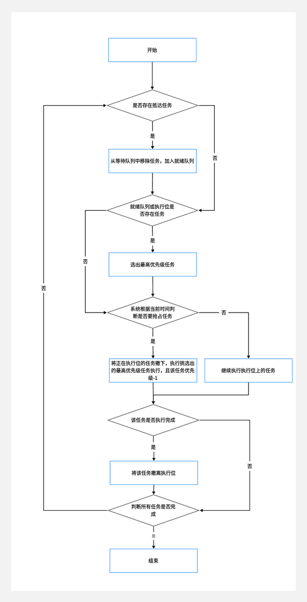

# 进程调度

**实验一 进程调度**

**一、实验目的**

多道程序设计中，经常是若干个进程同时处于就绪状态，必须依照某种策略来决定那个进程优先占有处理机。因而引起进程调度。本实验模拟在单处理机情况下的处理机调度问题，加深对进程调度的理解。


**二、实验内容**

1．优先权法、轮转法

简化假设

1） 进程为计算型的（无I/O）

2） 进程状态：ready、running、finish

3） 进程需要的CPU时间以时间片为单位确定

2．算法描述

1） 优先权法——动态优先权

当前运行进程用完时间片后，其优先权减去一个常数。

2） 轮转法

 

**三、实验要求**

1．如采用随机数，随机数的取值范围应加以限制，如所需的CPU时间限制在1~20之间。

2．进程数n不要太大通常取4~8个

3．独立编程

4．二种调度算法

5．若有可能请在图形方式下，将PCB的调度用图形成动画显示。

 

**四、实验方案**

为了更好的使用JavaSwing框架来构建UI界面，可以自己制定一套JavaSwing框架的小型封装组件。这里的JframeBuilder用于构建通用的窗体模板。

创建我的自定义菜单模板，采用了前端路由选择的思想，制定一套通用的路由-界面替换预设窗口。

使用此预设架构Jframe窗体，实现三个页面：配置页面，优先级调度算法渲染页面，轮转法调度算法渲染页面。

使用者需要预先在配置页面选择好进程数量和轮转时间片长度，设置完成后即可选择两种方法对应的菜单执行渲染动画并获取对应的数据。

 

**优先级法**

未到达的任务暂时缓存在一个waitList数组里

每次系统先检测waitList里面是否有任务要加入就绪队列（已获得全部资源）

检查就绪队列和执行位是否存在任务，若都不存在任务则系统进入下一时刻且进入下一循环

从就绪队列中拿到最高优先级任务

判断是否抵达系统优先级抢占时刻

若抵达，则将此最高优先级任务与执行位任务优先级比较，若高于则置换。若执行位无任务（上一次任务完成）则直接换入。

若未抵达，则判断是否拿到了最高优先级任务

若未拿到则不做操作

若拿到则判断执行位是否为空，若为空则换入任务，为之执行，且优先级-1

最后判断就绪队列，等待队列，执行位是否都为空（无未完成任务）

若都为空则结束循环

否则继续循环

 

 

 

**轮转法**

检查等待队列是否有任务抵达，加入抵达任务到就绪队列末尾

将上一次执行位任务（未完成）加入就绪队列末尾

检查就绪队列是否存在任务，若不存在任务则系统进入下一时刻，继续循环

获取就绪队列队头任务，并弹出队列

放入执行位，为之执行一个时间片

检查所有任务是否执行完毕，若执行完毕则结束循环，否则继续循环

 

 

 

 

 

**项目地址：**[GitHub - os467/JavaOs467: My java progaram(demo) hub.](https://github.com/os467/JavaOs467)

优先级调度算法流程图



 

轮转调度算法流程图


**运行结果展示**

**优先级法** **线程数****=4** **系统优先权检测时间** **= 3**


**轮转法** **线程数****=4****，时间片****=1**


**线程数****=8****，时间片****= 4**


 

**五、实验代码**

**使用UI界面组件： JavaSwing**

**使用编辑器：** **idea**

**package com.os467.project.core包**

**作业进程类**

```java
package com.os467.project.core;

/** 
 *作业进程
 * 
 */
public class HomeWork {

        //抵达时间
        private Integer arriveTime;

        //作业名
        private Character name;

        //当前优先级
        private Integer level;

        //作业所需完成时间
        private Integer endTime;

        //作业已执行时间
        private Integer nowTime = 0;

        //当前状态 0 就绪 1 执行 2 结束
        private Integer status;

        public Integer getArriveTime() {
            return arriveTime;
        }

        public Character getName() {
            return name;
        }

        public void setName(Character name) {
            this.name = name;
        }

        public Integer getLevel() {
            return level;
        }

        public void setLevel(Integer level) {
            this.level = level;
        }

        public Integer getEndTime() {
            return endTime;
        }

        public void setEndTime(Integer endTime) {
            this.endTime = endTime;
        }

        public Integer getNowTime() {
            return nowTime;
        }

        public void setNowTime(Integer nowTime) {
            this.nowTime = nowTime;
        }

        public Integer getStatus() {
            return status;
        }

        public void setStatus(Integer status) {
            this.status = status;
        }

        public void setArriveTime(Integer arriveTime) {
            this.arriveTime = arriveTime;
        }
    }
```

 

 

 

 

 

**弹窗类**

 

```java
package com.os467.project.core;

import javax.swing.*;
import java.awt.*;


/** 
 *运行结果弹窗
 * 
 */
public class MyDialog extends JDialog {
    public MyDialog(Frame owner, String title, String msg) {
        super(owner, title);// 调用JDialog父类的构造方法
        setVisible(true);
        // 创建一个具有指定标题和指定所有者的对话框。
        JTextArea jTextArea = new JTextArea();
        jTextArea.setEditable(false);
        jTextArea.setText(msg);
        jTextArea.setFont(new Font("dialog",0,18));
        JScrollPane jsp = new JScrollPane(jTextArea);
        //设置矩形大小.参数依次为(矩形左上角横坐标x,矩形左上角纵坐标y，矩形长度，矩形宽度)
        jsp.setBounds(13, 10, owner.getWidth()/3, owner.getHeight());
        add(jsp);
        setSize(owner.getWidth()/3, owner.getHeight());//大小
        // setModal(true);//设置为模态
        setLocationRelativeTo(null);//居中
        setDefaultCloseOperation(JDialog.*DISPOSE_ON_CLOSE*);//当点击对话框右上角的关闭按钮时,销毁该对话框

    }
}
```

 

 

**操作系统进程调度优先级法数据渲染器类**

```java
package com.os467.project.core;

import javax.swing.*;
import java.awt.*;
import java.util.ArrayList;
import java.util.Iterator;
import java.util.List;
import java.util.Random;

public class SystemMonitorX extends Thread{

    //等待队列
    private List<HomeWork> waitList;

    //就绪队列
    private List<HomeWork> readyList;

    //执行中的作业
    private HomeWork execution;

    private JPanel systemXPage;

    //作业数量
    private Integer num;

    //单位时间长度
    private Integer unitLength;

    //累计系统运行时间
    private Integer sumSystemRunTime = 0;

    //累计长度
    private Integer sumLength = 20;

    //抵达计数器
    private Integer arriveCount = 0;

    //系统运行时间
    private Integer systemRunTime = 0;

    //消息收集器
    private StringBuilder msg = new StringBuilder();

    int testC = 0;

    private List<ExecuteMsg> executeMsgList = new ArrayList<>();

    class ExecuteMsg{
        Integer executeTime;
        Character workName;

        public ExecuteMsg(Integer executeTime, Character name) {
            this.executeTime = executeTime;
            this.workName = name;
        }
    }

    @Override
    public void run() {

        waitList = new ArrayList<>();
        readyList = new ArrayList<>();

        init();

        //模拟操作系统运作
        while (true){

            //检查等待队列任务
            checkWaitList();

            //检查就绪队列是否存在作业
            if (readyList.size() <= 0 && execution == null){
                systemRunTime += WorkContent.*SYSTEM_RUN_TIME_UNIT*;
                executeMsgList.add(new ExecuteMsg(WorkContent.*SYSTEM_RUN_TIME_UNIT*,null));
                continue;
            }

            //从就绪队列中获取最高优先级任务
            HomeWork homeWork = selectHighestLevelWork();

            HomeWork executionWorkCache;
            if (systemRunTime % WorkContent.*SYSTEM_CHECK_LEVEL_TIME_INTERVAL* == 0 && homeWork != null){
                if (execution == null){
                    //将其从就绪队列中删除
                    removeAndExecute(homeWork);
                }else if ( homeWork.getLevel() > execution.getLevel()){
                    //抢占当前任务
                    msg.append("进程-"+homeWork.getName()+",优先级："+homeWork.getLevel()+",抢占进程-"+execution.getName()+",优先级："+execution.getLevel()+"\n");
                    readyList.add(execution);
                    removeAndExecute(homeWork);
                }

            }else if (homeWork != null){
                if (execution == null){
                    //将其从就绪队列中删除
                    removeAndExecute(homeWork);
                }
            }

            executionWorkCache = execution;
            //执行，获取执行时间
            Integer executeTime = execute(execution);

            //增加系统运行时间
            for (int i = 0; i < executeTime; i++) {
                systemRunTime += WorkContent.*SYSTEM_RUN_TIME_UNIT*;
                checkWaitList();

            }


            executeMsgList.add(new ExecuteMsg(executeTime,executionWorkCache.getName()));


            msg.append("========当前系统时间："+systemRunTime+"========\n");
            if (executionWorkCache.getStatus().equals(WorkContent.*FINISH_STATUS*)){
                msg.append("进程-"+executionWorkCache.getName()+"已完成，服务时间："+executionWorkCache.getEndTime()+"\n");
            }else if (execution != null){
                msg.append("进程-"+execution.getName()+"，进度：("+execution.getNowTime()+"/"+execution.getEndTime()+")，"+"优先级："+execution.getLevel()+"\n");
            }

            for (HomeWork work : readyList) {
                msg.append("进程-"+work.getName()+"，进度：("+work.getNowTime()+"/"+work.getEndTime()+")，"+"优先级："+work.getLevel()+"\n");
            }

            msg.append("=============================\n");

            //检查是否都执行完毕
            if (readyList.size()<=0 && waitList.size() <= 0 && execution == null){
                break;
            }
        }

        //产生基准长度
        unitLength = (int)((systemXPage.getWidth()*0.85)/(double)(systemRunTime));

        for (ExecuteMsg executeMsg : executeMsgList) {

            System.*out*.println(executeMsg.executeTime+executeMsg.workName);
            //构建页面新数据
            updatePageInfo(executeMsg.executeTime,executeMsg.workName);

            //模拟执行时间
            try {
                Thread.*sleep*(100 * executeMsg.executeTime);
            } catch (InterruptedException e) {
                e.printStackTrace();
            }

            //更新界面数据
            SwingUtilities.*updateComponentTreeUI*(systemXPage);

        }

        JFrame parent = (JFrame)SwingUtilities.*getRootPane*(systemXPage).getParent();
        new MyDialog(parent,"运行结果",msg.toString());
        System.*out*.println(msg.toString());

    }

    private void removeAndExecute(HomeWork homeWork) {
        removeFromReadyList(homeWork);
        execution = homeWork;
    }

    */**
   ** *检查等待作业入队
\*   **/
        \*
        private void checkWaitList() {
        Iterator<HomeWork> iterator = waitList.iterator();
        while (iterator.hasNext()) {
            HomeWork work = iterator.next();
            if (work.getArriveTime().equals(systemRunTime)) {
                iterator.remove();
                readyList.add(work);
                msg.append("========当前系统时间："+systemRunTime+"========\n");
                msg.append("进程-"+work.getName()+"已抵达\n");
                msg.append("=============================\n");
            }
        }

    }

    private void init() {
        //创建作业，加入就绪队列，优先级依次排列
        for (int i = 0; i < num; i++) {
            HomeWork homeWork = new HomeWork();
            homeWork.setArriveTime(arriveCount++*2);
            homeWork.setName((char)(i+48+17));
            homeWork.setEndTime(3+new Random().nextInt(5));

            //产生优先级 0优先级最低
            homeWork.setLevel(10+new Random().nextInt(20));
            //就绪状态
            homeWork.setStatus(WorkContent.*READY_STATUS*);
            homeWork.setNowTime(0);

            msg.append("进程-"+homeWork.getName()+"创建，预计用时："+homeWork.getEndTime()+"\n");

            //添加到等待队列
            waitList.add(homeWork);
        }

    }

    */**
   ** *更新页面数据
\*   ** **@param*** *executeTime
\*   **/
        \*   
        private void updatePageInfo(Integer executeTime, Character workName) {

        sumSystemRunTime += executeTime;

        JPanel page = systemXPage;

        Character name = workName;

        int boxWidth = executeTime * unitLength;
        if (name != null){
            Integer pageIndex = (int)(name)-48-17;

            int height = page.getHeight();

            JButton homeWorkLabel = new JButton();
            homeWorkLabel.setBackground(new Color(0,0,0));
            int boxHeight = height/(num+2)/9;


            int x = sumLength;
            int y = height/(num+2)*(pageIndex)+boxHeight*4;

            homeWorkLabel.setBounds(
                x,
                y,
                boxWidth,
                boxHeight);
            //添加进度条
            page.add(homeWorkLabel);

            //添加当前系统时间
            JLabel jLabel = new JLabel(sumSystemRunTime.toString());
            jLabel.setFont(new Font("dialog",1,10));
            jLabel.setBounds(
                x+boxWidth,
                y+boxHeight,
                boxWidth*2,
                boxHeight
            );
            page.add(jLabel);
        }

        sumLength+=boxWidth;

    }

    */**
   ** *操作系统为任务执行
\*   ** **@param*** *homeWork
\*   **/
        \*   
        private Integer execute(HomeWork homeWork) {
        //结束时间
        Integer endTime = homeWork.getEndTime();
        //当前执行时间
        Integer nowTime = homeWork.getNowTime();

        //实际执行时间
        Integer executeTime = WorkContent.*SYSTEM_RUN_TIME_UNIT*;

        //降低优先级
        execution.setLevel(execution.getLevel() - WorkContent.*LEVEL_DOWN_UNIT*);

        if (nowTime + WorkContent.*SYSTEM_RUN_TIME_UNIT* >= endTime){
            executeTime = endTime - nowTime;
            //作业完成
            homeWork.setStatus(WorkContent.*FINISH_STATUS*);
            execution = null;
        }

        //更新当前时间
        homeWork.setNowTime(nowTime + WorkContent.*SYSTEM_RUN_TIME_UNIT*);

        return executeTime;
    }

    */**
    ** *从就绪队列中删除
\*   ** **@param*** *homeWork
\*   **/
        \*   private void removeFromReadyList(HomeWork homeWork) {
        readyList.remove(homeWork);
    }


    */**
   ** *选择最高优先权的就绪状态作业
\*   ** **@return
**   \*/
        \*   
        private HomeWork selectHighestLevelWork() {
        Integer index = null;
        Integer level = null;
        //获取最高优先权就绪状态任务索引
        for (int i = 0; i < readyList.size(); i++) {
            HomeWork homeWork = readyList.get(i);
            if (index == null && homeWork.getStatus().equals(WorkContent.*READY_STATUS*)){
                index = i;
                level = homeWork.getLevel();
            }else if (homeWork.getStatus().equals(WorkContent.*READY_STATUS*)){
                Integer nl = homeWork.getLevel();
                if (nl > level){
                    level = nl;
                    index = i;
                }
            }
        }

        if (index != null){
            return readyList.get(index);
        }else {
            return null;
        }
    }

    public List<HomeWork> getReadyList() {
        return readyList;
    }

    public void setPage(JPanel systemXPage) {
        this.systemXPage = systemXPage;
    }

    public void setNum(Integer num) {
        this.num = num;
    }


}
```

 

 

 

 

 

 

 

 

 

 

 

 

**操作系统进程调度轮转法数据渲染器类**

```java
package com.os467.project.core;
 
 import javax.swing.*;
 import java.awt.*;
 import java.util.ArrayList;
 import java.util.Iterator;
 import java.util.List;
 import java.util.Random;
 
 public class SystemMonitorY extends Thread{
 
   //等待队列
   private List<HomeWork> waitList;
 
   //就绪队列
   private List<HomeWork> readyList;
 
   //执行中的作业
   private HomeWork execution;
 
   private JPanel systemYPage;
 
   //作业数量
   private Integer num;
 
   //时间片
   private Integer runTime = 1;
 
   //时间进度条基数
   private Integer sumTime=0;
 
   //单位时间长度
   private Integer unitLength;
 
   //累计系统运行时间
   private Integer sumSystemRunTime = 0;
 
   //累计长度
   private Integer sumLength = 20;
 
   //系统运行时间
   private Integer systemRunTime = 0;
 
   //抵达计数器
   private Integer arriveCount = 0;
 
   //消息收集器
   private StringBuilder msg = new StringBuilder();
 
   private List<ExecuteMsg> executeMsgList = new ArrayList<>();
 
   class ExecuteMsg{
     Integer executeTime;
     Character workName;
 
     public ExecuteMsg(Integer executeTime, Character name) {
       this.executeTime = executeTime;
       this.workName = name;
     }
   }
 
   @Override
   public void run() {
 
     waitList = new ArrayList<>();
     readyList = new ArrayList<>();
 
     init();
 
     //模拟操作系统运作
     while (true){
 
       //检查等待队列任务
       checkWaitList();
 
       //检查就绪队列是否存在作业
       if (readyList.size() <= 0){
         systemRunTime += WorkContent.*SYSTEM_RUN_TIME_UNIT*;
         executeMsgList.add(new ExecuteMsg(WorkContent.*SYSTEM_RUN_TIME_UNIT*,null));
         continue;
       }
 
       //从就绪队列中获取队头作业
       HomeWork homeWork = getWork();
 
       //将其从就绪队列中删除
       removeFromReadyList(homeWork);
 
       //加入执行位
       execution = homeWork;
 
       //执行
       Integer executeTime = execute(execution);
 
       //增加系统运行时间
       for (int i = 0; i < executeTime; i++) {
         checkWaitList();
         systemRunTime += WorkContent.*SYSTEM_RUN_TIME_UNIT*;
       }
 
       executeMsgList.add(new ExecuteMsg(executeTime,homeWork.getName()));
 
 
       msg.append("========当前系统时间："+systemRunTime+"========\n");
 
       if (homeWork.getStatus().equals(WorkContent.*FINISH_STATUS*)){
         msg.append("进程-"+homeWork.getName()+"已完成，服务时间："+homeWork.getEndTime()+"\n");
       }else if (execution != null) {
         msg.append("进程-"+homeWork.getName()+"，进度：("+homeWork.getNowTime()+"/"+homeWork.getEndTime()+")\n");
       }
 
 
       for (HomeWork work : readyList) {
         msg.append("进程-"+work.getName()+"，进度：("+work.getNowTime()+"/"+work.getEndTime()+")\n");
       }
       msg.append("=============================\n");
 
       //检查是否都执行完毕
       if (readyList.size()<=0 && waitList.size() <= 0 && execution == null){
         break;
       }
     }
 
     //产生基准长度
     unitLength = (int)((systemYPage.getWidth()*0.85)/(double)(systemRunTime));
 
     for (ExecuteMsg executeMsg : executeMsgList) {
 
       //构建页面新数据
       updatePageInfo(executeMsg.executeTime,executeMsg.workName);
 
       //模拟执行时间
       try {
         Thread.*sleep*(100 * executeMsg.executeTime);
       } catch (InterruptedException e) {
         e.printStackTrace();
       }
 
       //更新界面数据
       SwingUtilities.*updateComponentTreeUI*(systemYPage);
 
     }
 
 
     JFrame parent = (JFrame)SwingUtilities.*getRootPane*(systemYPage).getParent();
     new MyDialog(parent,"运行结果",msg.toString());
     System.*out*.println(msg.toString());
 
 
   }
 
   */**
   ** *检查等待作业入队
\*   **/
\*   private void checkWaitList() {
     Iterator<HomeWork> iterator = waitList.iterator();
     while (iterator.hasNext()) {
       HomeWork work = iterator.next();
       if (work.getArriveTime().equals(systemRunTime)) {
         iterator.remove();
         readyList.add(work);
         msg.append("========当前系统时间："+systemRunTime+"========\n");
         msg.append("进程-"+work.getName()+"已抵达\n");
         msg.append("=============================\n");
       }
     }
 
     if (execution != null){
       readyList.add(execution);
       execution = null;
     }
 
   }
 
   */**
   ** *更新页面数据
\*   **/
\*   private void updatePageInfo(Integer executeTime, Character workName) {
 
     sumSystemRunTime+=executeTime;
 
     JPanel page = systemYPage;
 
     Character name = workName;
 
     int boxWidth = executeTime * unitLength;
 
     if (name != null) {
       Integer pageIndex = (int) (name) - 48 - 17;
 
       int height = page.getHeight();
 
       JButton homeWorkLabel = new JButton();
       homeWorkLabel.setBackground(new Color(0, 0, 0));
       int boxHeight = height / (num + 2) / 9;
 
       int x = sumLength;
       int y = height / (num + 2) * (pageIndex) + boxHeight * 4;
 
       homeWorkLabel.setBounds(
           x,
           y,
           boxWidth,
           boxHeight);
       //添加进度条
       page.add(homeWorkLabel);
 
       //添加当前系统时间
       JLabel jLabel = new JLabel(sumSystemRunTime.toString());
       jLabel.setFont(new Font("dialog", 1, 10));
       jLabel.setBounds(
           x + boxWidth,
           y + boxHeight,
           boxWidth * 2,
           boxHeight
       );
       page.add(jLabel);
     }
 
     sumLength+=boxWidth;
 
   }
 
   */**
   ** *操作系统为任务执行一个时间片
\*   ** **@param*** *homeWork
\*   **/
\*   private Integer execute(HomeWork homeWork) {
     //结束时间
     Integer endTime = homeWork.getEndTime();
     //当前执行时间
     Integer nowTime = homeWork.getNowTime();
 
     //实际执行时间
     Integer executeTime = 0;
 
     if (nowTime + runTime >= endTime){
       executeTime = endTime - nowTime;
       //作业完成
       homeWork.setStatus(WorkContent.*FINISH_STATUS*);
       execution = null;
     }else {
       //时间片用完
       executeTime = runTime;
     }
 
     //更新当前时间
     homeWork.setNowTime(nowTime + runTime);
 
     return executeTime;
   }
 
   */**
   ** *获取队头任务
\*   ** **@return
**   \*/
\*   private HomeWork getWork() {
     return readyList.get(0);
   }
 
   */**
   ** *从就绪队列中删除
\*   ** **@param*** *homeWork
\*   **/
       \*   
       private void removeFromReadyList(HomeWork homeWork) {
       readyList.remove(homeWork);
   }

     private void init() {
         //创建作业，加入就绪队列
         for (int i = 0; i < num; i++) {
             HomeWork homeWork = new HomeWork();
             homeWork.setArriveTime(arriveCount++*runTime);
             homeWork.setName((char)(i+48+17));
             homeWork.setEndTime(3+new Random().nextInt(5));

             sumTime+=homeWork.getEndTime();

             //就绪状态
             homeWork.setStatus(WorkContent.*READY_STATUS*);
             homeWork.setNowTime(0);

             msg.append("进程-"+homeWork.getName()+"创建，预计用时："+homeWork.getEndTime()+"\n");

             //添加到等待队列
             waitList.add(homeWork);
         }

         //产生基准长度
         unitLength = (int)((systemYPage.getWidth()*0.85)/(double)(sumTime));
     }

     public void setPage(JPanel systemYPage) {
         this.systemYPage = systemYPage;
     }

     public void setNum(Integer num) {
         this.num = num;
     }

     public void setRunTime(Integer runTime) {
         this.runTime = runTime;
     }
 }
```

  

 

**全局常量类**

```java
package com.os467.project.core;
 
 public class WorkContent {
   public static final int *READY_STATUS* = 1;
   public static final int *FINISH_STATUS* = 2;
   public static final int *LEVEL_DOWN_UNIT* = 1;
   public static final int *SYSTEM_RUN_TIME_UNIT* = 1;
   public static final int *SYSTEM_CHECK_LEVEL_TIME_INTERVAL* = 3;
 }
```

 

 

 

 

**package com.os467.project.init****包**

**窗口初始化类**

 

```java
package com.os467.project.init;
 
 import JFrameBuilder.WindowBuilder;
 import JFrameBuilder.defaultImpl.DefaultJFrameBuilder;
 import com.os467.project.jFrameBuild.JFrameContentMakerImpl;
 
 public class Init {
 
   public static void main(String[] args) {
 
     new WindowBuilder().
         register(new DefaultJFrameBuilder())
         .register(new JFrameContentMakerImpl())
         .getFrame();
   }
 
 }
```

 


 

 

**package com.os467.project.jFrameBuild****包**

**窗体内容制作者实现类**

```java
package com.os467.project.jFrameBuild;
 
 import JFrameBuilder.JFrameContentMaker;
 import JFrameBuilder.component.LeftSelectMenu;
 import com.os467.project.core.SystemMonitorX;
 import com.os467.project.core.SystemMonitorY;
 
 
 import javax.swing.*;
 import java.awt.*;
 import java.awt.event.ActionEvent;
 import java.awt.event.ActionListener;
 
 
 public class JFrameContentMakerImpl implements JFrameContentMaker {
 
 
   //线程数量
   private Integer num = 4;
 
   //时间片
   private Integer runTime = 1;
 
   private LeftSelectMenu leftSelectMenu;
 
   private JPanel systemXPage;
 
   private JPanel systemYPage;
 
   private Thread runMonitor;
 
   @Override
   public void make(JFrame jFrame) {
 
     jFrame.getContentPane();
 
     leftSelectMenu = new LeftSelectMenu(jFrame, 3);
 
     leftSelectMenu.setDefaultPage(getDefaultPage());
 
     leftSelectMenu.name(0,"配置界面");
     leftSelectMenu.name(1,"优先权法");
     leftSelectMenu.name(2,"轮转法");
 
     systemXPage = leftSelectMenu.getPage(1);
     systemYPage = leftSelectMenu.getPage(2);
 
     systemPageBuild(leftSelectMenu.getPage(0));
 
   }
 
   */**
   ** *创建介绍页面
\*   ** **@return
**   \*/
\*   private JPanel getDefaultPage() {
     JPanel jPanel = new JPanel();
     jPanel.setLayout(null);
     jPanel.setBackground(new Color(234, 234, 234));
     JTextPane jTextPane = new JTextPane();
     jTextPane.setBounds(50,50,300,300);
     jTextPane.setFont(new Font("dialog",0,25));
     jTextPane.setText(" 点击左侧菜单栏配置界面，配置完毕后再点击对应的方法");
     jTextPane.setEnabled(false);
     jPanel.add(jTextPane);
     return jPanel;
   }
 
   */**
   ** *配置界面
\*   ** **@param*** *page
\*   **/
\*   private void systemPageBuild(JPanel page) {
     int width = page.getWidth();
     int height = page.getHeight();
 
     page.setLayout(null);
 
     JTextField numField = new JTextField("4");
     numField.setBackground(new Color(255, 255, 255));
     numField.setBounds(10,height/(num+2),width/10,height/10);
     page.add(numField);
 
     JButton startButton = new JButton("设置线程数量");
     startButton.setBackground(new Color(255, 255, 255));
     startButton.setBounds(width/10 + 10,height/(num+2),width/7,height/10);
 
     JTextField runTimeField = new JTextField("1");
     runTimeField.setBackground(new Color(255, 255, 255));
     runTimeField.setBounds(10,height/(num+2)*2,width/10,height/10);
     page.add(runTimeField);
 
     JButton runTimeButton = new JButton("设置时间片");
     runTimeButton.setBackground(new Color(255, 255, 255));
     runTimeButton.setBounds(width/10 + 10,height/(num+2)*2,width/7,height/10);
 
 
     ActionListener actionListener = new ActionListener() {
       @Override
       public void actionPerformed(ActionEvent e) {
         String numFieldText = numField.getText();
         String runTimeText = runTimeField.getText();
         num = Integer.*parseInt*(numFieldText);
         runTime = Integer.*parseInt*(runTimeText);
         systemPageClear(systemXPage);
         systemXPageBuild(systemXPage);
 
         systemPageClear(systemYPage);
         systemYPageBuild(systemYPage);
       }
     };
 
     //线程数更新监听事件
     startButton.addActionListener(actionListener);
     runTimeButton.addActionListener(actionListener);
     page.add(startButton);
     page.add(runTimeButton);
 
   }
 
   */**
   ** *清除页面
\*    ** **@param*** *page
\*   **/
\*   public void systemPageClear(JPanel page) {
     page.removeAll();
   }
 
   */**
   ** *优先权法渲染界面实现
\*   ** **@param*** *page
\*   **/
\*   public void systemXPageBuild(JPanel page) {
 
     int width = page.getWidth();
     int height = page.getHeight();
 
     page.setLayout(null);
 
     for (int i = 0; i < num; i++) {
       JLabel homeWorkLabel = new JLabel(""+(char)(i+48+17));
       homeWorkLabel.setBounds(10,height/(num+2)*i,width,height/(num+2));
       page.add(homeWorkLabel);
     }
 
     JButton startButton = new JButton("开始");
     startButton.setBackground(new Color(255, 255, 255));
     startButton.setBounds(10,height/(num+2)*num,width/10,height/10);
     page.add(startButton);
 
 
     //绑定监听事件
     startButton.addActionListener(new SystemXStarter());
 
 
   }
 
   */**
   ** *系统**Y**执行监听事件
\*   **/
\*   class SystemYStarter implements ActionListener{
 
     @Override
     public void actionPerformed(ActionEvent e) {
       if (runMonitor != null && runMonitor.isAlive()){
         runMonitor.stop();
       }
       systemPageClear(systemYPage);
       systemYPageBuild(systemYPage);
       SystemMonitorY systemMonitorY = new SystemMonitorY();
       runMonitor = systemMonitorY;
       systemMonitorY.setPage(systemYPage);
       systemMonitorY.setNum(num);
       systemMonitorY.setRunTime(runTime);
 
       //启动
       systemMonitorY.start();
     }
   }
 
   */**
   ** *系统**X**执行监听事件
\*   **/
\*   class SystemXStarter implements ActionListener{
 
     @Override
     public void actionPerformed(ActionEvent e) {
       if (runMonitor != null && runMonitor.isAlive()){
         runMonitor.stop();
       }
       systemPageClear(systemXPage);
       systemXPageBuild(systemXPage);
       SystemMonitorX systemMonitorX = new SystemMonitorX();
       runMonitor = systemMonitorX;
       systemMonitorX.setPage(systemXPage);
       systemMonitorX.setNum(num);
 
       //启动
       systemMonitorX.start();
     }
   }
 
 
 
   */**
   ** *轮转法渲染界面实现
\*   ** **@param*** *page
\*   **/
\*   public void systemYPageBuild(JPanel page) {
 
     int width = page.getWidth();
     int height = page.getHeight();
 
     page.setLayout(null);
 
     for (int i = 0; i < num; i++) {
       JLabel homeWorkLabel = new JLabel(""+(char)(i+48+17));
       homeWorkLabel.setBounds(10,height/(num+2)*i,width,height/(num+2));
       page.add(homeWorkLabel);
     }
 
     JButton startButton = new JButton("开始");
     startButton.setBackground(new Color(255, 255, 255));
     startButton.setBounds(10,height/(num+2)*num,width/10,height/10);
     page.add(startButton);
 
 
     startButton.addActionListener(new SystemYStarter());
   }
 }
```

 

 

 

 

 

 

 

 

 

**自制框架包**

**左侧选择式路由菜单模板类**

 

```java
package JFrameBuilder.component;
 
 import javax.swing.*;
 import java.awt.*;
 import java.awt.event.ActionEvent;
 import java.awt.event.ActionListener;
 import java.util.ArrayList;
 import java.util.List;
 
 
 public class LeftSelectMenu extends JPanel {
 
   private Integer routerNum;
 
   private List<JPanel> pageList;
 
   private JPanel selector;
 
   private Color selectorColor;
 
   private JPanel defaultPage;
 
 
   public LeftSelectMenu(JFrame jFrame, Integer routerNum){
     if (routerNum >=8){
       routerNum = 8;
     }
     jFrame.setResizable(false);
     this.routerNum = routerNum;
     setLayout(null);
     this.setSize(jFrame.getSize());
 
     buildSelector(routerNum,0.2);
     buildPage();
 
     add(selector);
 
     //add FirstPage
     defaultPage = new JPanel();
     defaultPage.setLayout(new BorderLayout());
     defaultPage.setBackground(new Color(0,0,0));
     defaultPage.setBounds(selector.getWidth(),0,(int)(getWidth()*0.8),getHeight());
     add(defaultPage);
 
     Container contentPane = jFrame.getContentPane();
     contentPane.add(this);
   }
 
   protected List<JPanel> getPageList() {
     return this.pageList;
   }
 
   private void buildPage() {
     pageList = new ArrayList<>();
     for (int i = 0; i < routerNum; i++) {
       JPanel page = new JPanel();
       page.setLayout(null);
       page.setBounds(selector.getWidth(),0,(int)(getWidth()*0.8),getHeight());
       pageList.add(page);
     }
   }
 
   */**
   \* build selectorJPanel
   \* **@param*** *routerNum
\*   ** **@param*** *leftPercent
\*   **/
\*   private void buildSelector(Integer routerNum, double leftPercent) {
     selectorColor = new Color(237, 235, 235);
     selector = new JPanel();
     selector.setLayout(null);
     selector.setBackground(selectorColor);
 
     setLeftPercent(0.2);
 
     int width = selector.getWidth();
     int height = selector.getHeight();
 
     ActionListener monitor = new SelectorChangeMonitor(this);
     //build selectMenu
     for (int i = 0; i < routerNum; i++) {
       JButton button = new JButton();
       button.setBackground(selectorColor);
       button.setBounds(0,(int)(height/8)*i,width,(int)(height/8));
       button.setName(""+i);
       button.addActionListener(monitor);
       selector.add(button);
     }
 
     //build selectorContent by os467
     JPanel selectorContent = new JPanel();
     selectorContent.setLayout(new BorderLayout());
     selectorContent.add(new JLabel("made by os467"),BorderLayout.*CENTER*);
     selectorContent.setBounds(0,(height/8)*routerNum,width,getHeight()-(height/8)*routerNum);
     selectorContent.setBackground(new Color(77, 77, 77));
     selector.add(selectorContent);
   }
 
   */**
   \* name the selectorButton
   \* **@param*** *index
\*   ** **@param*** *name
\*   **/
\*   public void name(Integer index, String name){
     if (index >= routerNum){
       return;
     }
     JButton button = (JButton)selector.getComponent(index);
     button.setText(name);
   }
 
   */**
   \* set Selector leftPercent
   \* **@param*** *leftPercent
\*   **/
\*   public void setLeftPercent(double leftPercent){
     selector.setSize((int)(getWidth()*leftPercent),getHeight());
   }
 
   */**
   \* get Page
   \* **@param*** *index
\*    ** **@return
**   \*/
\*   public JPanel getPage(Integer index){
     if (index >= routerNum){
       return null;
     }
     return this.pageList.get(index);
   }
 
   */**
   \* set default page
   \* **@param*** *defaultPage
\*   **/
\*   public void setDefaultPage(JPanel defaultPage) {
     remove(this.defaultPage);
     this.defaultPage = defaultPage;
     this.defaultPage.setBounds(selector.getWidth(),0,(int)(getWidth()*0.8),getHeight());
     add(this.defaultPage);
   }
 }
 
 class SelectorChangeMonitor implements ActionListener{
 
   private LeftSelectMenu leftSelectMenu;
 
   public SelectorChangeMonitor(LeftSelectMenu leftSelectMenu){
     this.leftSelectMenu = leftSelectMenu;
   }
 
   @Override
   public void actionPerformed(ActionEvent e) {
     JButton btn = (JButton) e.getSource();
     leftSelectMenu.remove(1);
     List<JPanel> pageList = leftSelectMenu.getPageList();
     JPanel panel = pageList.get(Integer.*parseInt*(btn.getName()));
     leftSelectMenu.add(panel);
     SwingUtilities.*updateComponentTreeUI*(leftSelectMenu);
   }
 }
```

 

 

**窗体构建者接口**

```java
package JFrameBuilder;
 
 import javax.swing.*;
 
 */**
 \* Implement build method and make your own jFrame window
 \*/
\* public interface JFrameBuilder {
   JFrame build();
 }
```

 

**窗体内容构建者接口**

```java
package JFrameBuilder;
 
 import javax.swing.*;
 import java.awt.*;
 
 public interface JFrameContentMaker {
 
   void make(JFrame jFrame);
 
 }
```

 

**默认窗体构建者实现类**

```java
package JFrameBuilder.defaultImpl;
 
 import JFrameBuilder.*;
 
 import javax.swing.*;
 import java.awt.*;
 
 public class DefaultJFrameBuilder implements JFrameBuilder {
 
   protected JFrame jFrame;
 
   @Override
   public JFrame build() {
     jFrame = new JFrame();
     jFrame.setVisible(true);
     Dimension screenSize = Toolkit.*getDefaultToolkit*().getScreenSize();
     double width = screenSize.getWidth();
     double height = screenSize.getHeight();
     jFrame.setBounds((int)(width*0.2),(int)(height*0.2),(int)(width*0.618),(int)(height*0.618));
     jFrame.setBackground(new Color(0,0,0));
     jFrame.setDefaultCloseOperation(WindowConstants.*EXIT_ON_CLOSE*);
     return jFrame;
   }
 }
```

 

**默认窗体内容制作者实现类**

```java
package JFrameBuilder.defaultImpl;
 
 import JFrameBuilder.JFrameContentMaker;
 
 import javax.swing.*;
 
 public class DefaultJFrameContentMaker implements JFrameContentMaker {
   @Override
   public void make(JFrame jFrame) {
   }
 }
```

 

 

**窗体构建工具类**

```java
package JFrameBuilder;
 
 import javax.swing.*;
 import java.awt.*;
 
 public class JFrameUtils {
 
   private JFrameUtils(){
 
   }
 
   public static void batchAddCenterJLabel(Container contentPane,JLabel... labels){
     for (JLabel label : labels) {
       label.setHorizontalAlignment(SwingUtilities.*CENTER*);
     }
     batchAdd(contentPane,labels);
   }
 
   public static void batchAdd(Container contentPane,Component... components){
     for (Component component : components) {
       contentPane.add(component);
     }
   }
 }
```

 

**窗口构建者类**

```java
package JFrameBuilder;
 
 import JFrameBuilder.defaultImpl.DefaultJFrameBuilder;
 import JFrameBuilder.defaultImpl.DefaultJFrameContentMaker;
 
 import javax.swing.*;
 import java.awt.*;
 
 public class WindowBuilder {
 
   private JFrameBuilder jFrameBuilder;
 
   private JFrameContentMaker jFrameContentMaker;
 
   public JFrame getFrame(){
     return buildFrame();
   }
 
   public WindowBuilder() {
     jFrameBuilder = new DefaultJFrameBuilder();
     jFrameContentMaker = new DefaultJFrameContentMaker();
   }
 
   */**
   \* register builder
   \* **@param*** *jFrameBuilder
\*   ** **@return
**   \*/
\*   public WindowBuilder register(JFrameBuilder jFrameBuilder){
     this.jFrameBuilder = jFrameBuilder;
     return this;
   }
 
   */**
   \* register contentMaker
   \* **@param*** *jFrameContentMaker
\*   ** **@return
**   \*/
\*   public WindowBuilder register(JFrameContentMaker jFrameContentMaker){
     this.jFrameContentMaker = jFrameContentMaker;
     return this;
   }
 
   */**
   \* build the frame
   \* **@return
**   \*/
\*   private JFrame buildFrame() {
     JFrame frame = jFrameBuilder.build();
     jFrameContentMaker.make(frame);
     return frame;
   }
 
 }
```

 

 

 

 

 

**六、预习中的问题及对应思考**

图像渲染问题，一开始采用了一遍进行算法数据生成，一边进行数据渲染的方法。存在数据与渲染的耦合。

**解决方案：**

先生成数据，使用一个消息收集器msg进行数据收集，使用Msg对象对每次的数据进行格式化封装。

再渲染图形，通过对Msg对象队列进行解析后再生成数据。

同时解决了因为无法提前获取的运行总时间问题

**提前获取运行总时间问题**

 

由于渲染的窗口大小固定，因此单位时间渲染的像素长度也要根据运行总时间计算确定，原先通过累加任务时间的方式确定总时间是有问题的。（可能存在就绪队列暂无任务，系统等待的问题）

而实际通过算法运行得到数据后，再进行渲染，即可解决无法提前获取运行总时间的问题。

 

 

**UI****设计**

采用了路由绑定页面的侧边栏选择菜单设计，提前定制了一套API，可以快速上手使用。

预设类LeftSelectMenu

 

 

**算法设计**

 

轮转算法本身较为容易实现，就不用说了。但需要注意的是每次执行完毕任务后应当先将达到任务加入就绪队列，再将此任务加入就绪队列（未完成），模拟操作系统撤离任务时间开销。

 

优先级算法，存在多种实现机制。非抢占式最为容易实现，但缺点也很明显，若存在高优先级别的长作业，则对低优先级的短作业不太公平，这里选择了抢占式的动态优先级算法。

抢占式动态优先级算法可以引入操作系统优先级调度时间间隔的概念，即固定一小段时间再进行优先级的判断。

防止了相同优先级任务互相抢占造成的调度时间开销的问题。